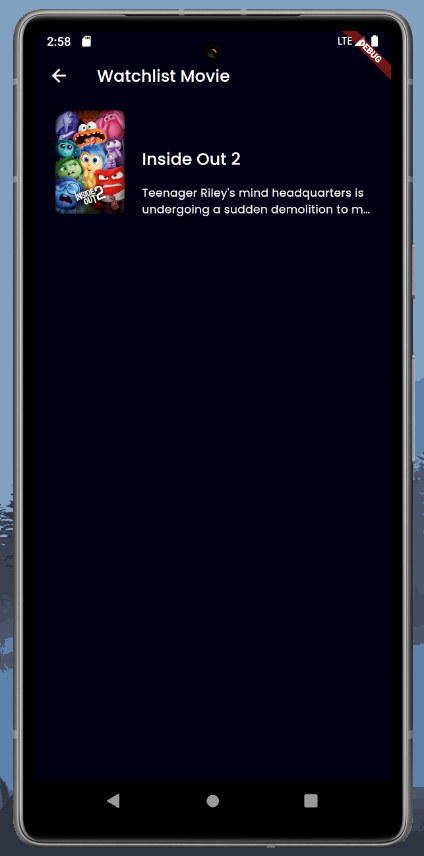
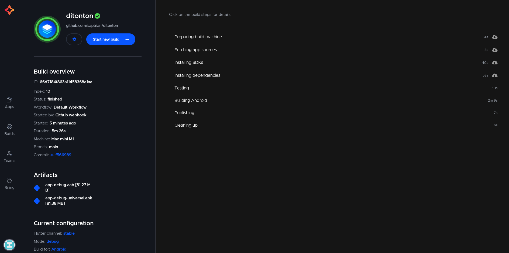
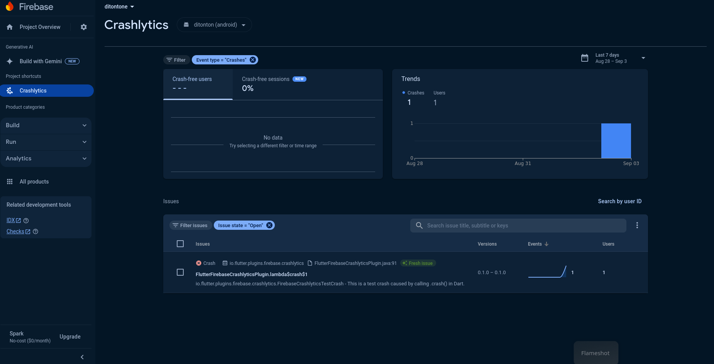

# ditonton

[](https://codemagic.io/app/66d6c76e0becf10eb5ff9a3e/build/66d71580863a114583688a96)

**ditonton** is a sleek and user-friendly mobile application that provides up-to-date information about movies and TV series using data from The Movie Database (TMDb) API. Whether you're a casual viewer or a dedicated cinephile, this app is your go-to resource for discovering new films, exploring popular TV shows, and tracking your favorites.




## Test App Screenshots

Here are some screenshots from the test app to demonstrate various states and functionalities:






## Features

- **Movie and TV Series Information:** Get the latest details on movies and TV shows using TMDb API.
- **Modular Architecture:** The codebase follows a modular structure for better maintainability and scalability.
- **Test-Driven Development (TDD):** Ensure high code quality with comprehensive unit and widget tests.
- **Dependency Injection:** Utilizes `get_it` for efficient dependency management.
- **SSL Pinning:** Secure communication with servers using SSL pinning.
- **Crashlytics Integration:** Monitor app stability and catch errors with Firebase Crashlytics.
- **Analytics:** Track user interactions and app usage with Firebase Analytics.

## Getting Started

### Prerequisites

- Flutter SDK version `>=3.5.0 <4.0.0`
- Dart SDK

### Installation

1. Clone the repository:

   ```bash
   git clone https://github.com/saptrian/ditonton.git
   cd ditonton
   ```
